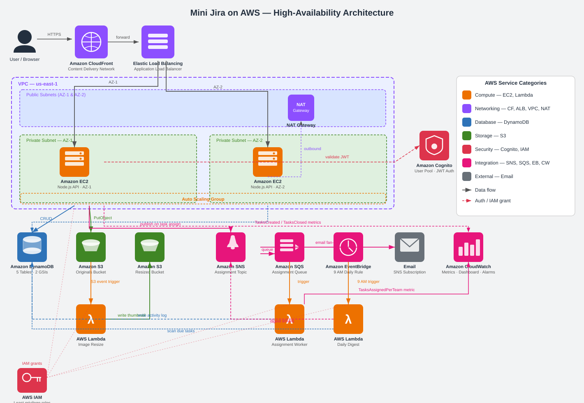
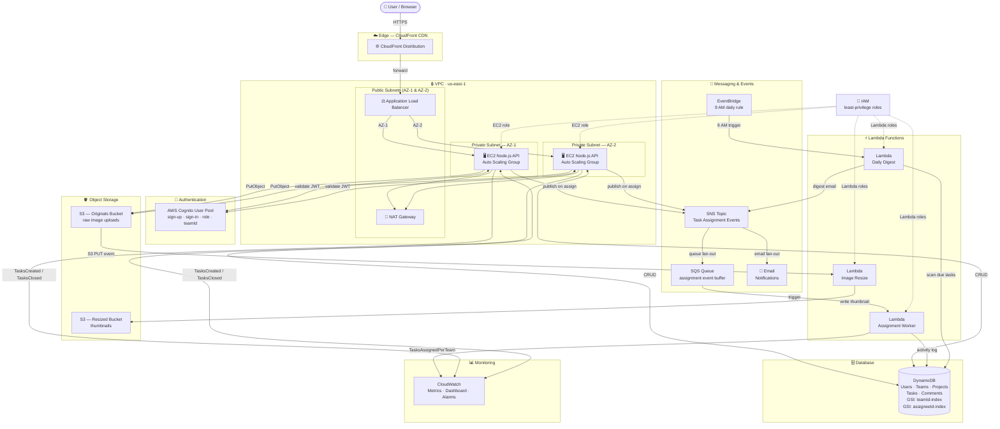

# Mini Jira on AWS — Architecture

## Architecture Diagram



---

## Detailed Flow Diagram (Mermaid)



---

## Service Roles

| Service | Role in the System |
|---|---|
| **EC2 (Auto Scaling Group)** | Hosts the Node.js/Express backend across AZ-1 and AZ-2. The ASG maintains a minimum of 2 instances and scales on CPU utilization. |
| **Application Load Balancer** | Distributes HTTPS traffic across EC2 instances, runs health checks, and routes only to healthy targets. |
| **CloudFront** | CDN in front of the ALB. Low-latency delivery of the app and static assets. The CloudFront URL is the public entry point. |
| **VPC + Subnets** | Public subnets hold the ALB and NAT Gateway. EC2 instances run in private subnets with no direct internet exposure. |
| **NAT Gateway** | Allows EC2 instances in private subnets to reach the internet (e.g. Cognito JWKS endpoint) without being publicly reachable. |
| **AWS Cognito** | User Pool for sign-up / sign-in. Stores `role` and `teamId` per user. Backend validates every JWT against the Cognito JWKS endpoint on every request. |
| **DynamoDB** | Stores all data: Users, Teams, Projects, Tasks, Comments. Tasks table has a GSI on `teamId` (team-scoped queries) and a GSI on `assigneeId` (per-user task lists). |
| **S3 — Originals Bucket** | Stores raw task image attachments. Old images are retained on update (new S3 key per upload). |
| **S3 — Resized Bucket** | Stores thumbnails generated by the Image Resize Lambda for compact UI display. |
| **Lambda — Image Resize** | Triggered by `s3:ObjectCreated` events on the originals bucket. Resizes the image and writes a thumbnail to the resized bucket. |
| **Lambda — Assignment Worker** | Subscribed to the SQS queue. Writes an activity-log entry to DynamoDB and publishes the `TasksAssignedPerTeam` CloudWatch custom metric. |
| **Lambda — Daily Digest** | Triggered by EventBridge at 9:00 AM UTC. Scans the Tasks table for items due today and sends a digest email per assignee via SNS. |
| **SNS** | Receives task-assignment events from the backend. Fans out to (a) an email subscription for the assignee and (b) the SQS queue for background processing. |
| **SQS** | Buffers assignment events between SNS and the Assignment Worker Lambda. Decouples the API response path and provides retry semantics. |
| **EventBridge** | Scheduled rule `cron(0 9 * * ? *)` — fires every day at 9:00 AM UTC and invokes the Daily Digest Lambda. |
| **CloudWatch** | Receives custom metrics (`TasksCreated`, `TasksClosed`, `TasksAssignedPerTeam`). Dashboard with 4 widgets: tasks created per day, tasks closed per day per team, average time-to-close, EC2 CPU utilization. Alarm fires when overdue tasks exceed a threshold. |
| **IAM** | Least-privilege roles: EC2 instance role grants DynamoDB, S3, SNS, CloudWatch access. Each Lambda has its own scoped role. |

---

## Data Flows

### Task Creation with Image Upload
```
Manager
  → CloudFront → ALB → EC2
  → Cognito: validate JWT
  → DynamoDB: PutItem (Tasks table)
  → S3: PutObject (originals bucket)
      → Lambda Image Resize triggered
      → Thumbnail written to S3 resized bucket
  → SNS: Publish assignment event
      → Email: assignee notified
      → SQS → Lambda Assignment Worker
          → DynamoDB: activity log entry
          → CloudWatch: TasksAssignedPerTeam metric
  → CloudWatch: TasksCreated metric
```

### Employee Task View (Team Isolation)
```
Employee
  → CloudFront → ALB → EC2
  → Cognito: validate JWT (teamId extracted)
  → DynamoDB: Query on teamId-index GSI  ← server-side filter
  → Only tasks belonging to the employee's team returned
```

### Daily Digest (Scheduled)
```
EventBridge (9:00 AM)
  → Lambda Daily Digest
  → DynamoDB: Scan tasks due today
  → SNS: Publish digest per assignee
  → Email delivered to each assignee
```

### Status Update (Employee)
```
Employee
  → CloudFront → ALB → EC2
  → Cognito: validate JWT (role = Employee)
  → Backend enforces: only status field may be updated
  → DynamoDB: UpdateItem (status + updatedAt)
  → CloudWatch: TasksClosed metric (if status = Done)
```

---

## High-Availability Layout

```
                      AWS Region — us-east-1
  ┌─────────────────────────────────────────────────────────┐
  │                                                         │
  │   CloudFront  ──────►  Application Load Balancer        │
  │                              │           │              │
  │          ┌───────────────────┘           └────────┐     │
  │          ▼                                        ▼     │
  │   ┌─────────────────┐               ┌─────────────────┐ │
  │   │   AZ-1          │               │   AZ-2          │ │
  │   │   Private Subnet│               │   Private Subnet│ │
  │   │   EC2 (ASG)     │               │   EC2 (ASG)     │ │
  │   └────────┬────────┘               └────────┬────────┘ │
  │            └──────────────┬──────────────────┘          │
  │                           ▼                             │
  │                  DynamoDB  ·  S3  ·  SNS                │
  │                  SQS  ·  Lambda  ·  CloudWatch          │
  └─────────────────────────────────────────────────────────┘
```

- ALB spans both AZs and routes only to healthy instances.
- Auto Scaling Group keeps at least one EC2 per AZ; scales out on CPU > 70%.
- DynamoDB is fully managed and regionally replicated — no single point of failure.
- S3 is regionally durable (11 nines) by default.
- NAT Gateway deployed per AZ to eliminate cross-AZ outbound dependency.
