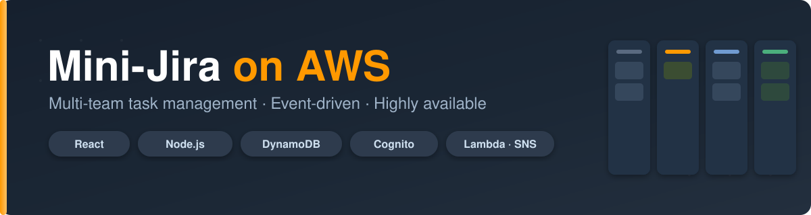

<p align="center">
  
</p>

# Mini-Jira on AWS

A lightweight, multi-team task-management web application (a stripped-down Jira/Trello) running entirely on AWS. The system supports multiple teams within a company, role-based access, server-side team isolation, an event-driven assignment pipeline, a Lambda image-resize pipeline, scheduled digest emails, and full CloudWatch monitoring — deployed across two Availability Zones behind an Application Load Balancer and CloudFront.

**Course:** Software Cloud Computing 2026 — Dr. John Zaki
**Deadline:** 22/5/2026


**Application (CloudFront):** https://d26he9mvtyemga.cloudfront.net
---

## Demo Scenario (works without code changes)

- Manager **Ali** creates **Task A** → assigns to **Sara** (Frontend team).
- Manager **Ali** creates **Task B** → assigns to **Omar** (Backend team).
- **Sara** logs in → sees only **Task A**.
- **Omar** logs in → sees only **Task B**.
- **Ali** logs back in as manager → sees both tasks and can filter by team.

Team filtering is enforced **server-side** (every API handler checks `teamId`), so an employee cannot fetch another team's task even by guessing its ID.

---

## Tech Stack

| Layer | Technology |
|-------|-----------|
| Frontend | React + Tailwind CSS (Kanban board with drag-and-drop, task detail modal, toasts, loading/empty states) |
| Backend | Node.js + Express |
| Database | DynamoDB |
| Auth | AWS Cognito (role + teamId stored as user attributes) |
| AWS SDK | AWS SDK for JavaScript v3 |
| Process manager | PM2 (`mini-jira`) on EC2 |

The frontend and backend live in a single monorepo.

---

## Architecture

The full architecture diagram (drawn with AWS standard icons) is in [`docs/architecture.png`](docs/architecture.png).

High-level flow:

```
                         ┌─────────────┐
        Users ──────────▶│  CloudFront │  (CDN, low-latency delivery)
                         └──────┬──────┘
                                │
                         ┌──────▼──────┐
                         │     ALB     │  (health checks + traffic distribution)
                         └──────┬──────┘
              ┌─────────────────┴─────────────────┐
       AZ-a   │                                   │   AZ-b
        ┌─────▼─────┐                       ┌─────▼─────┐
        │   EC2     │  ◀── Auto Scaling ──▶ │   EC2     │   (Node.js backend)
        │ (private) │                       │ (private) │
        └─────┬─────┘                       └─────┬─────┘
              └─────────────────┬─────────────────┘
                                │
        ┌───────────────────────┼────────────────────────────┐
        ▼            ▼          ▼            ▼                 ▼
   DynamoDB     S3 (originals) Cognito    SNS ──▶ SQS ──▶ Worker Lambda
   (GSIs:       │                                  │      (activity log +
    teamId,     ▼ S3 PUT                           │       CloudWatch metric)
    assigneeId) Lambda (Image Resize)              │
                ▼                            EventBridge (09:00 daily)
           S3 (resized)                            ▼
                                            Daily Digest Lambda ──▶ SNS email

   CloudWatch: custom metrics, dashboard, alarms (e.g. HighTaskCreationAlarm → SNS)
```

### Networking

- **VPC:** `project-vpc` (`10.0.0.0/16`)
- **Public subnets:** ALB + NAT gateway (across 2 AZs)
- **Private subnets:** EC2 instances (across 2 AZs)
- **NAT gateway:** outbound internet access for private EC2

### Auto Scaling

- ASG: `mini-jira-asg`
- Desired capacity: **2**, Max: **4**
- Target tracking policy: **60% average CPU utilization**

---

## AWS Services

| Service | Role |
|---------|------|
| EC2 (Auto Scaling Group) | Hosts the Node.js backend across ≥2 AZs |
| Application Load Balancer | Distributes traffic + health checks |
| CloudFront | CDN in front of the ALB |
| DynamoDB | Users, Teams, Projects, Tasks, Comments. GSIs on `teamId` and `assigneeId` |
| S3 (originals) | Task image attachments; old versions retained on update |
| S3 (resized) | Thumbnails from the resize Lambda |
| Lambda — Image Resize | Triggered by S3 PUT on originals; writes thumbnails to resized bucket |
| Lambda — Assignment Worker | Drains SQS, writes activity log, publishes `TasksAssignedPerTeam` metric |
| Lambda — Daily Digest | EventBridge-triggered at 09:00; scans tasks due today, emails assignees via SNS |
| SNS | Fan-out for assignment events: email to assignee + feeds SQS |
| SQS | Buffers assignment events; decouples API from background work |
| EventBridge | Scheduled rule (09:00 daily) → Daily Digest Lambda |
| Cognito | User pool for sign-up/sign-in; stores `role` and `teamId` |
| CloudWatch | Custom metrics, dashboard, alarms |
| IAM | Least-privilege roles for EC2 and each Lambda |
| VPC + Subnets | Public (ALB) / private (EC2) subnets + NAT gateway |

---

## Features

### Roles & Teams
- **Manager** — creates projects/tasks, assigns to any employee on any team, sees all tasks, sees per-team dashboards.
- **Employee** — sees only their own team's tasks, updates status of assigned tasks, comments, attaches files.
- **Admin** (merged with Manager) — creates teams and adds users.

### Task Lifecycle
- Fields: title, description, priority, deadline, assignee, team, optional image.
- Status flow: **To Do → In Progress → In Review → Done**.
- Threaded comments per task.
- File/image attachments in S3, resized by Lambda on upload.
- Audit log of status changes (who moved it, when).

### Team Isolation
Tasks are filtered by `teamId` **on the server**, using a DynamoDB GSI on `teamId`, enforced in every API handler. The manager bypasses this filter.

### CRUD Coverage
- Tasks: Create / Read / Update / Delete
- Projects: Create / Read / Update / Delete
- Comments: Create / Read
- Images: upload, replacement (old versions retained in S3), deletion alongside the task

### Event-Driven Notifications
On task assignment, the API publishes to an SNS topic that fans out to (a) an email subscription for the assignee and (b) an SQS queue drained by the worker Lambda, which writes an activity-log entry and publishes the `TasksAssignedPerTeam` custom metric.

### Scheduled Digest
An EventBridge rule runs daily at 09:00, triggering a Lambda that scans tasks due that day and sends each assignee a digest email via SNS.

### CloudWatch Monitoring
Dashboard widgets:
1. Tasks created per day
2. Tasks closed per day per team
3. Average time-to-close
4. EC2 CPU utilization
5. Task-assignment metric

Alarm: `HighTaskCreationAlarm` publishes to an SNS topic when the threshold is exceeded.

---


## Local Setup

```bash
# Clone
git clone https://github.com/AhmedhassanB/Mini-Jira-on-AWS.git
cd Mini-Jira-on-AWS

# Install dependencies
npm install

# Configure environment (see .env.example)
cp .env.example .env

# Build the frontend
npm run build

# Run
npm start
```

### Environment Variables
```
AWS_REGION=
COGNITO_USER_POOL_ID=
COGNITO_CLIENT_ID=
DYNAMODB_TASKS_TABLE=
S3_ORIGINALS_BUCKET=
S3_RESIZED_BUCKET=
SNS_ASSIGNMENT_TOPIC_ARN=
SQS_QUEUE_URL=
```

---

## Deployment / Update Workflow (on EC2)

```bash
git stash
git pull
npm run build
pm2 restart mini-jira
```
